# Project structure
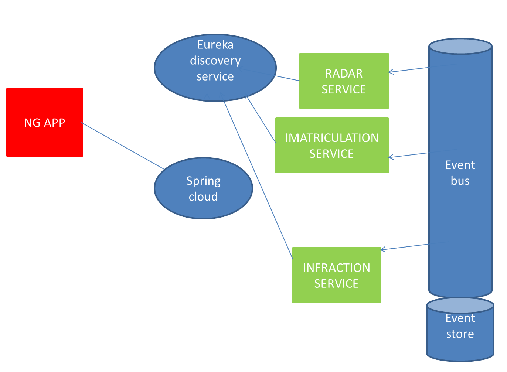
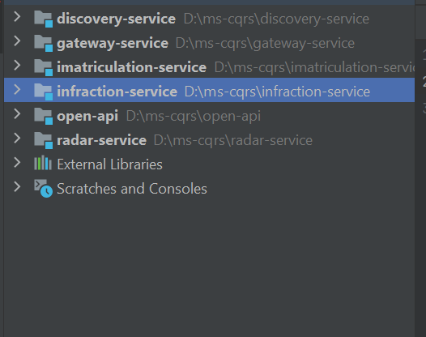
# Diagramme de classe
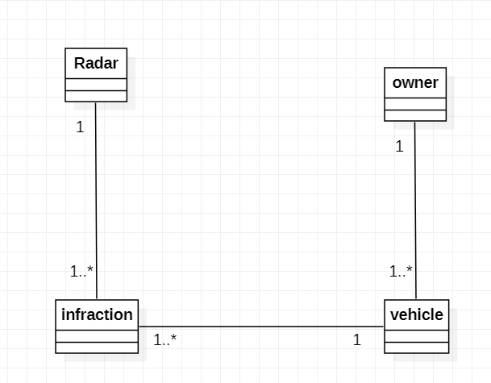
# Radar MS
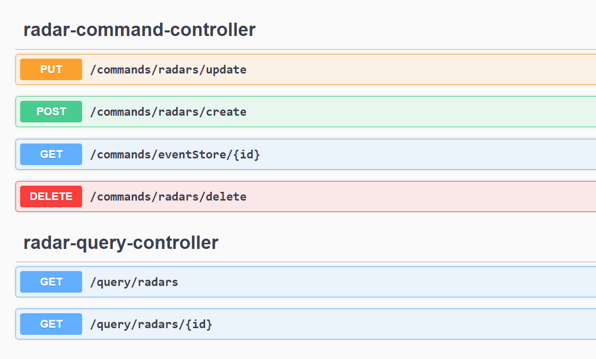
## Radar Event store
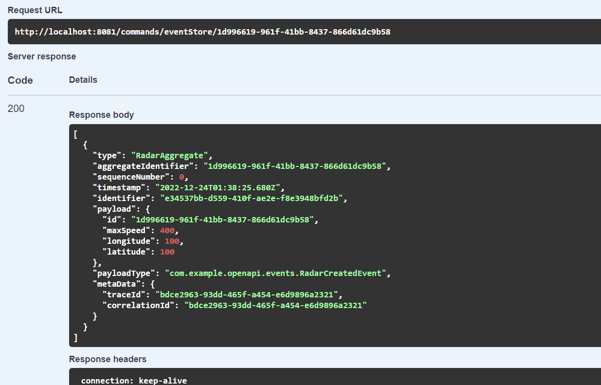
## get All radars query
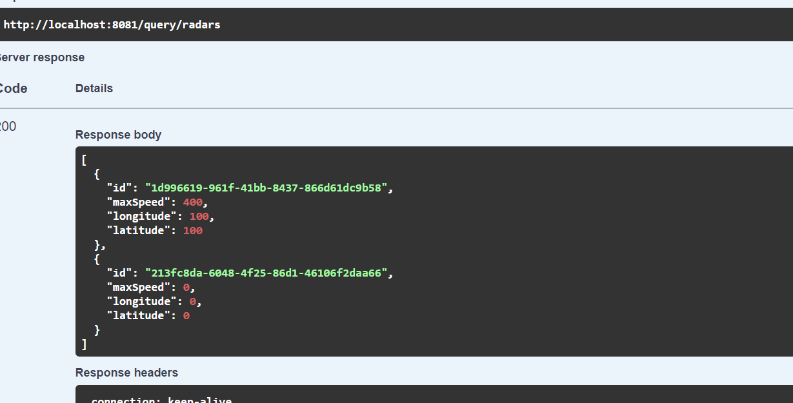
# Vehicle MS
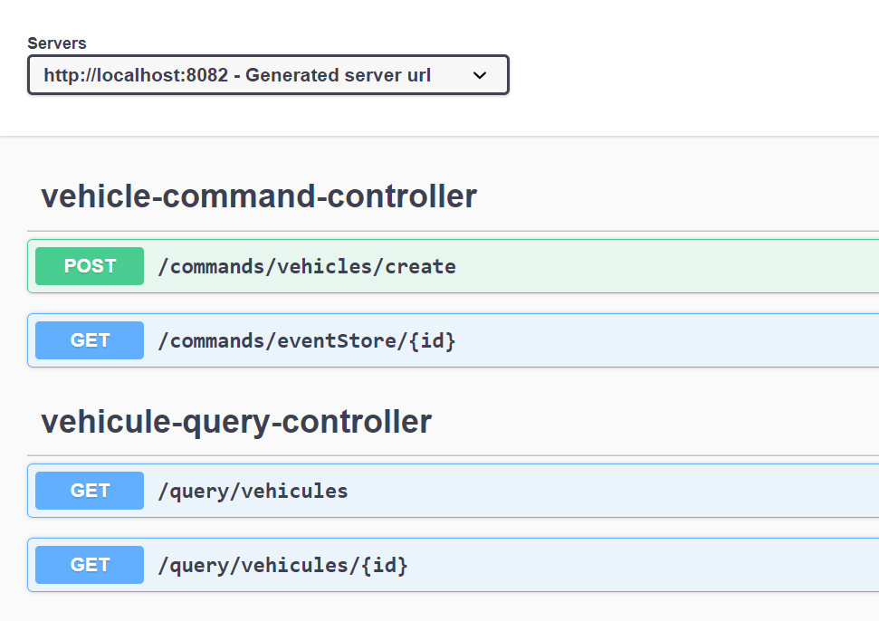
## Vehicle Event store
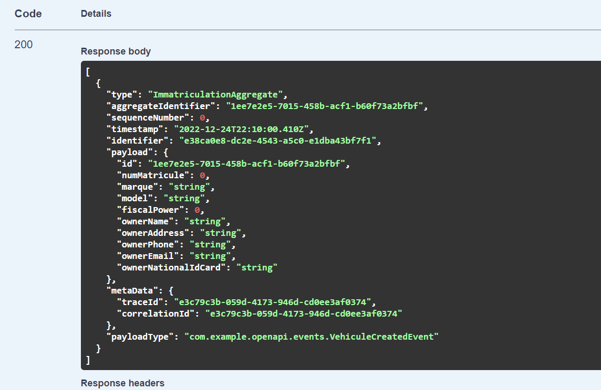
## get All Vihecles query
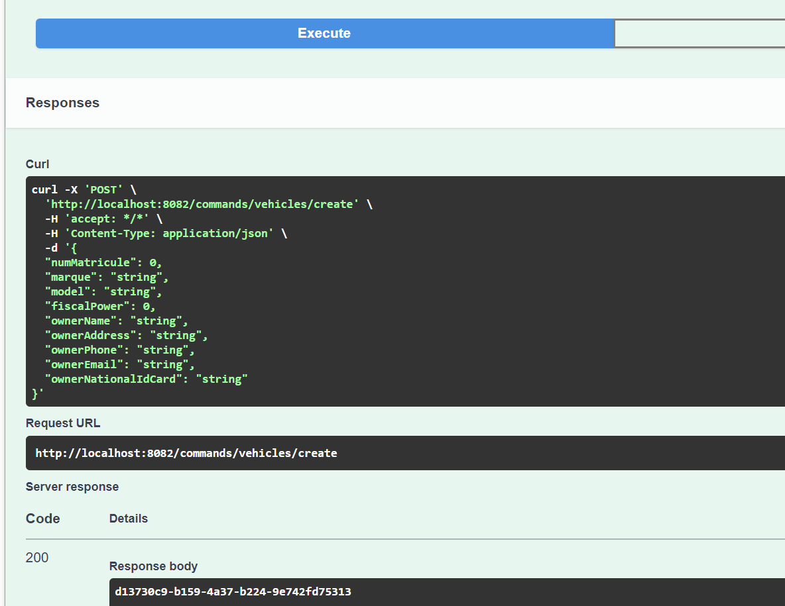
# securing MS with keycloak
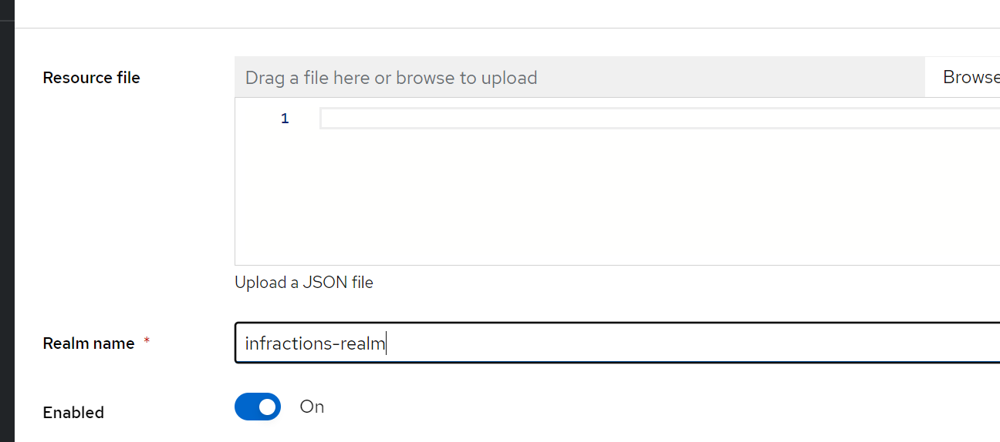
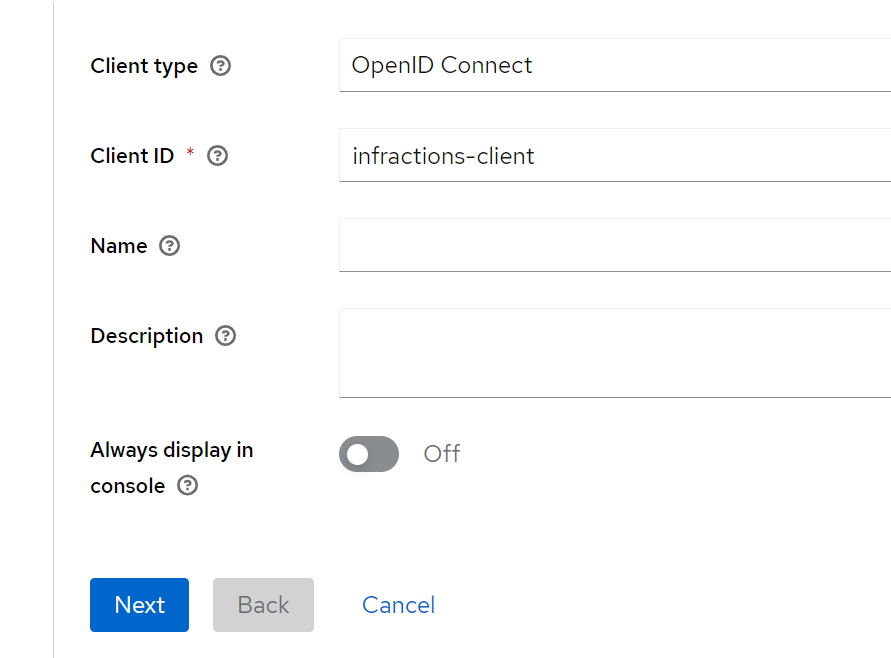
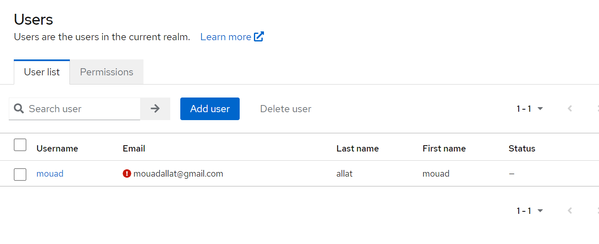
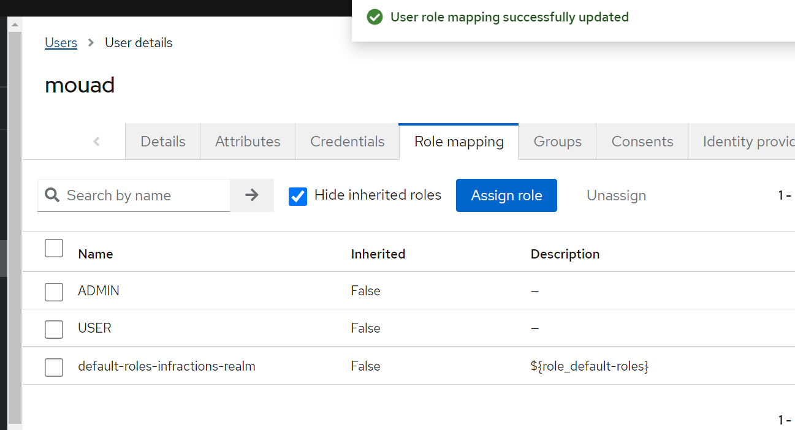
